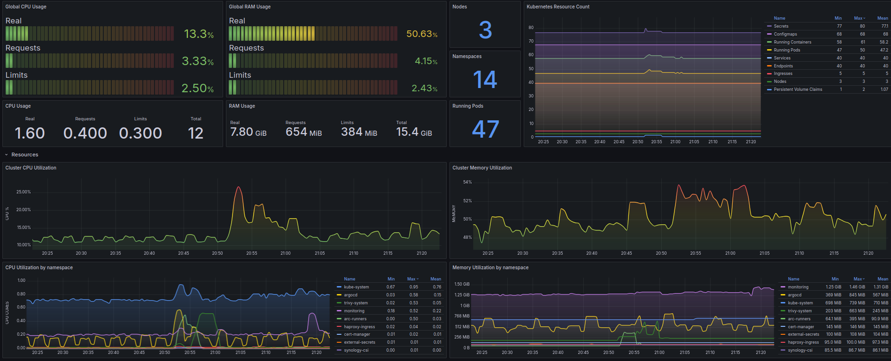

# kub1k

  

The name comes from a silly portmanteau between kube and m1k (my nickname)  
This repository contains the Terraform code for deploying and managing a homelab k8s infrastructure.

## Overview

The kub1k project aims to provide a scalable and easily maintainable Kubernetes cluster using K3s. The base infrastructure is provisioned using Terraform; once the cluster and CNI are operational, ArgoCD handles the application deployment and management.

The following components are part of this setup:

| Component                        | Source                                                                                                   |
| -------------------------------- | -------------------------------------------------------------------------------------------------------- |
| ArgoCD                           | https://github.com/argoproj/argo-cd                                                                      |
| External Secrets Operator        | https://github.com/external-secrets/external-secrets                                                     |
| Calico                           | https://github.com/projectcalico/calico                                                                  |
| Metallb                          | https://github.com/metallb/metallb                                                                       |
| HAProxy Ingress                  | https://github.com/jcmoraisjr/haproxy-ingress                                                            |
| GitHub Actions Runner Controller | https://github.com/actions/actions-runner-controller                                                     |
| Kube-Prometheus-Stack            | https://github.com/prometheus-community/helm-charts                                                      |
| Cert-Manager                     | https://github.com/cert-manager/cert-manager                                                             |
| Synology CSI Driver              | https://github.com/SynologyOpenSource/synology-csi                                                       |
| Custom Helm charts               | https://github.com/ironashram/kub1k/tree/main/charts                                                     |

## Prerequisites

Before deploying the infrastructure, make sure you have the following prerequisites:

- OpenTofu: Version >= 1.11.0
- Helm: Version >= 3.17.0
- Kubernetes: Version >= 1.32.0
- OpenBao: Version >= 2.3.0

## Getting Started

To deploy the infrastructure, follow these steps:

1. Clone this repository to your local machine.
2. Navigate to the project directory.
3. Initialize the Terraform backend by running `make init`.
4. Review and modify the variables in the `variables.tf` file according to your environment.
5. Run `make plan` to see the execution plan.
6. Run `make apply` to deploy the infrastructure.

For more detailed instructions, please refer to the [Terraform documentation](https://www.terraform.io/docs/index.html).

## License

This project is licensed under the [MIT License](LICENSE).

## Credits

The grafana dashboards are based on the followings projects:

- [Kubernetes Mixin](https://github.com/kubernetes-monitoring/kubernetes-mixin)
- [Prometheus 2.0 Grafana dashboard](https://github.com/FUSAKLA/Prometheus2-grafana-dashboard)
- [Grafana Dashboards K8s](https://github.com/dotdc/grafana-dashboards-kubernetes)
