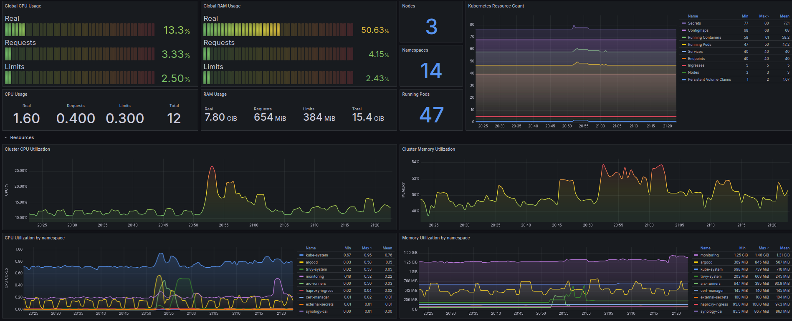

# kub1k

  

The name comes from a silly portmanteau between kube and m1k (my nickname)  
This repository contains the OpenTofu code and Argo CD applications for deploying and managing a homelab k8s infrastructure.

## Overview

kub1k is a K3s cluster on Flatcar Container Linux, running as VMs on Synology Virtual Machine Manager. The number of control plane nodes (embedded etcd) and dedicated workers is set by `control_count` and `worker_count`, and `label_controls_as_worker` lets the control plane nodes run workloads too. OpenTofu provisions the VMs, installs K3s and bootstraps Calico, CoreDNS, kube-vip and Argo CD. From there an Argo CD app of apps deploys everything else.

The following components are part of this setup:

| Component                           | Source                                                                    |
| ----------------------------------- | ------------------------------------------------------------------------- |
| Synology Provider                   | https://github.com/ironashram/terraform-provider-synology                 |
| Argo CD                             | https://github.com/argoproj/argo-cd                                       |
| Calico                              | https://github.com/projectcalico/calico                                   |
| CoreDNS                             | https://github.com/coredns/coredns                                        |
| kube-vip                            | https://github.com/kube-vip/kube-vip                                      |
| MetalLB                             | https://github.com/metallb/metallb                                        |
| n42-gateway                         | https://github.com/n42-gateway/n42-gateway                                |
| cert-manager                        | https://github.com/cert-manager/cert-manager                              |
| cert-manager Hetzner webhook        | https://charts.hetzner.cloud                                              |
| External Secrets Operator           | https://github.com/external-secrets/external-secrets                      |
| Synology CSI Driver                 | https://github.com/SynologyOpenSource/synology-csi                        |
| CloudNativePG                       | https://github.com/cloudnative-pg/cloudnative-pg                          |
| Keycloak                            | https://github.com/keycloak/keycloak                                      |
| Headlamp                            | https://github.com/kubernetes-sigs/headlamp                               |
| Kube-Prometheus-Stack               | https://github.com/prometheus-community/helm-charts                       |
| VictoriaMetrics                     | https://github.com/VictoriaMetrics/VictoriaMetrics                        |
| Prometheus Pushgateway              | https://github.com/prometheus/pushgateway                                 |
| Custom Helm charts                  | https://github.com/ironashram/kub1k/tree/main/charts                      |

## Repository layout

- `terraform/`: node VMs, the GitHub Actions runner VM, the K3s install, the bootstrap components and Keycloak SSO
- `apps/`: the Argo CD app of apps, one `Application` per component
- `charts/`: local Helm charts used by those applications
- `tools/`: helper scripts and the K3s version upgrader

## Prerequisites

- OpenTofu
- make, curl and jq
- Go, for `make upgrade-kubernetes-version`
- An OpenBao token in `VAULT_ADDR` and `VAULT_TOKEN`
- Credentials for the S3 state backend in `AWS_ACCESS_KEY_ID` and `AWS_SECRET_ACCESS_KEY`

## Getting Started

1. Clone this repository and change into it.
2. Review the variables in `terraform/variables.tf`, `terraform/vm_variables.tf` and `terraform/runner_variables.tf`.
3. Run `make init`. It fetches the kubeconfig from OpenBao and initializes the backend.
4. Run `make plan` to see the execution plan.
5. Run `make apply` to apply it.

Run `make help` for the other targets.

## Automation

- Pull requests touching `terraform/` get a plan comment, and merging applies that plan. Both run on the self-hosted runner VM.
- [argocd-apps-action](https://github.com/ironashram/argocd-apps-action) opens pull requests for new chart versions of the Argo CD applications.
- Dependabot opens pull requests for major workflow action bumps and for OpenTofu provider bumps.

## License

This project is licensed under the [MIT License](LICENSE).

## Credits

The cluster runs on:

- [Flatcar Container Linux](https://www.flatcar.org/)
- [K3s](https://github.com/k3s-io/k3s)

The grafana dashboards are based on the followings projects:

- [Kubernetes Mixin](https://github.com/kubernetes-monitoring/kubernetes-mixin)
- [Prometheus 2.0 Grafana dashboard](https://github.com/FUSAKLA/Prometheus2-grafana-dashboard)
- [Grafana Dashboards K8s](https://github.com/dotdc/grafana-dashboards-kubernetes)
